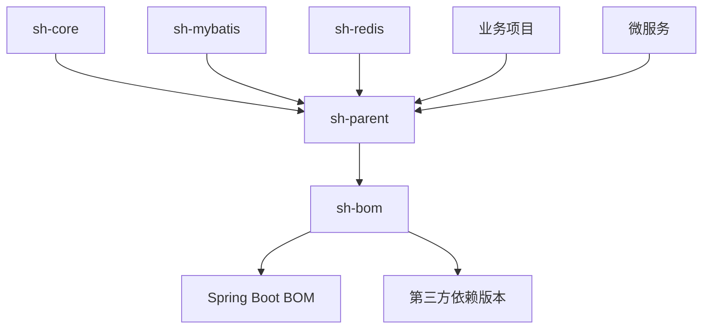

# BOM (物料清单)

> Maven Bill of Materials - 统一依赖版本管理的核心组件

## 概述

`sh-bom` 是 sh-framework 框架的物料清单模块，用于统一管理整个框架生态系统中所有依赖的版本。它通过 Maven 的 `<dependencyManagement>` 机制，确保所有组件使用兼容且一致的依赖版本，避免版本冲突和兼容性问题。

## 设计理念

### 为什么需要 BOM？

在微服务和多模块架构中，依赖管理面临以下挑战：

1. **版本冲突**：不同模块可能引入同一依赖的不同版本
2. **兼容性问题**：未经测试的依赖组合可能导致运行时错误
3. **维护成本高**：每个模块都需要单独管理依赖版本
4. **安全风险**：分散的依赖管理难以统一更新安全补丁

`sh-bom` 通过集中式版本管理解决了这些问题，提供了：
- ✅ **统一版本控制**：所有组件使用相同版本的依赖
- ✅ **兼容性保证**：经过充分测试的依赖组合
- ✅ **简化配置**：子项目无需指定依赖版本
- ✅ **安全更新**：统一更新安全漏洞修复

## 核心功能

### 支持的依赖类别

`sh-bom` 管理以下类别的依赖版本：

#### 1. 基础工具库
- **Apache Commons**：commons-collections4 等
- **Google Guava**：Java 工具库
- **Hutool**：Java 工具包
- **Lombok**：Java 注解处理器

#### 2. 数据持久化
- **MySQL Connector**：MySQL 数据库驱动
- **Druid**：数据库连接池
- **MyBatis**：ORM 框架
- **PageHelper**：分页插件

#### 3. 消息与缓存
- **Redis**：缓存和数据存储
- **MQTT**：物联网消息协议
- **XXL-Job**：分布式任务调度

#### 4. 安全与认证
- **JJWT**：JSON Web Token
- **Bouncy Castle**：加密库
- **微信 SDK**：微信生态集成

#### 5. 云服务与存储
- **AWS S3**：对象存储
- **阿里云 OSS**：对象存储
- **支付宝 SDK**：支付集成

#### 6. 其他工具
- **FastJSON2**：JSON 处理
- **ZXing**：二维码生成
- **Rhino**：JavaScript 引擎

## 使用方法

### 1. 在项目中引入 BOM

在项目的父 `pom.xml` 中导入 `sh-bom`：

```xml
<dependencyManagement>
    <dependencies>
        <!-- 导入 sh-bom -->
        <dependency>
            <groupId>com.wkclz.framework</groupId>
            <artifactId>sh-bom</artifactId>
            <version>5.0.0-SNAPSHOT</version>
            <type>pom</type>
            <scope>import</scope>
        </dependency>
    </dependencies>
</dependencyManagement>
```

### 2. 使用 BOM 管理的依赖

导入 BOM 后，可以直接使用依赖而无需指定版本：

```xml
<dependencies>
    <!-- 无需指定版本，版本由 BOM 统一管理 -->
    <dependency>
        <groupId>cn.hutool</groupId>
        <artifactId>hutool-all</artifactId>
    </dependency>
    
    <dependency>
        <groupId>com.alibaba.fastjson2</groupId>
        <artifactId>fastjson2</artifactId>
    </dependency>
    
    <dependency>
        <groupId>org.projectlombok</groupId>
        <artifactId>lombok</artifactId>
    </dependency>
</dependencies>
```

### 3. 在 sh-framework 子模块中使用

对于 sh-framework 的子模块，版本通过父工程统一管理：

```xml
<!-- 子模块的 pom.xml -->
<parent>
    <groupId>com.wkclz.framework</groupId>
    <artifactId>sh-parent</artifactId>
    <version>5.0.0-SNAPSHOT</version>
</parent>

<artifactId>sh-core</artifactId>

<dependencies>
    <!-- 所有依赖版本由 sh-bom 统一管理 -->
    <dependency>
        <groupId>com.google.guava</groupId>
        <artifactId>guava</artifactId>
    </dependency>
</dependencies>
```

## 版本管理策略

### 版本命名规范

所有依赖版本在 `sh-bom/pom.xml` 的 `<properties>` 中定义，遵循以下规范：

```xml
<properties>
    <!-- 格式：<artifactId>.version -->
    <hutool.version>5.8.42</hutool.version>
    <fastjson2.version>2.0.60</fastjson2.version>
    <mysql-connector-j.version>9.5.0</mysql-connector-j.version>
    <!-- ... 其他依赖版本 -->
</properties>
```

### 版本更新流程

1. **定期检查**：每月检查依赖的新版本和安全更新
2. **兼容性测试**：新版本需通过框架集成测试
3. **版本发布**：通过 CI/CD 流程发布新版本
4. **变更通知**：重大版本变更提供迁移指南

### 当前管理的版本示例

以下是 `sh-bom` 当前管理的主要依赖版本：

| 依赖 | 版本 | 说明 |
|------|------|------|
| Spring Boot | 4.0.0 | 基础框架 |
| Hutool | 5.8.42 | Java 工具包 |
| FastJSON2 | 2.0.60 | JSON 处理 |
| MySQL Connector | 9.5.0 | MySQL 驱动 |
| MyBatis Spring Boot Starter | 4.0.0 | ORM 框架 |
| Lombok | 1.18.42 | 代码生成 |
| Druid | 1.2.28-SNAPSHOT | 连接池 |
| JJWT | 0.13.0 | JWT 令牌 |

## 最佳实践

### 1. 新项目集成

对于新项目，建议按以下步骤集成：

```xml
<!-- 1. 继承 sh-parent 或导入 sh-bom -->
<parent>
    <groupId>com.wkclz.framework</groupId>
    <artifactId>sh-parent</artifactId>
    <version>5.0.0-SNAPSHOT</version>
</parent>

<!-- 2. 添加需要的依赖（无需版本） -->
<dependencies>
    <dependency>
        <groupId>com.wkclz.framework</groupId>
        <artifactId>sh-core</artifactId>
    </dependency>
    <dependency>
        <groupId>com.wkclz.framework</groupId>
        <artifactId>sh-mybatis</artifactId>
    </dependency>
</dependencies>
```

### 2. 现有项目迁移

将现有项目迁移到使用 `sh-bom`：

1. **移除版本声明**：删除各个依赖的 `<version>` 标签
2. **导入 BOM**：在 `<dependencyManagement>` 中导入 `sh-bom`
3. **解决冲突**：使用 `mvn dependency:tree` 检查版本冲突
4. **测试验证**：运行完整的测试套件

### 3. 自定义版本覆盖

在极少数需要覆盖 BOM 版本的情况下：

```xml
<properties>
    <!-- 覆盖 BOM 中的版本 -->
    <hutool.version>5.9.0</hutool.version>
</properties>

<dependencyManagement>
    <dependencies>
        <!-- 先导入 BOM -->
        <dependency>
            <groupId>com.wkclz.framework</groupId>
            <artifactId>sh-bom</artifactId>
            <version>5.0.0-SNAPSHOT</version>
            <type>pom</type>
            <scope>import</scope>
        </dependency>
    </dependencies>
</dependencyManagement>
```

## 常见问题

### Q1: 如何查看当前 BOM 管理的所有依赖版本？
```bash
# 查看 sh-bom 中定义的所有版本
cat sh-framework/sh-bom/pom.xml | grep "\.version"
```

### Q2: 依赖版本冲突如何解决？
```bash
# 1. 查看依赖树
mvn dependency:tree

# 2. 排除冲突的依赖
<dependency>
    <groupId>冲突的groupId</groupId>
    <artifactId>冲突的artifactId</artifactId>
    <exclusions>
        <exclusion>
            <groupId>要排除的groupId</groupId>
            <artifactId>要排除的artifactId</artifactId>
        </exclusion>
    </exclusions>
</dependency>
```

### Q3: 如何更新 BOM 中的依赖版本？
1. 修改 `sh-bom/pom.xml` 中的版本属性
2. 运行 `mvn clean install` 安装到本地仓库
3. 在子项目中测试兼容性
4. 提交更改并触发 CI/CD

### Q4: BOM 和 Parent 的区别是什么？
- **BOM**：只管理依赖版本，不继承插件和配置
- **Parent**：继承插件、配置、依赖管理（包含 BOM）
- 推荐使用 `sh-parent` 作为父工程，它已经集成了 `sh-bom`

## 架构设计

### 模块关系图



### 版本控制流程

```mermaid
sequenceDiagram
    participant Dev as 开发者
    participant BOM as sh-bom
    parent CI as CI/CD
    participant Test as 测试环境
    participant Prod as 生产环境
    
    Dev->>BOM: 更新依赖版本
    BOM->>CI: 触发构建
    CI->>Test: 部署测试
    Test-->>CI: 测试通过
    CI->>Prod: 发布新版本
```

## 贡献指南

### 添加新依赖

如需在 `sh-bom` 中添加新依赖：

1. **评估必要性**：确认依赖是框架级别必需的
2. **版本调研**：选择稳定且兼容的版本
3. **添加定义**：在 `sh-bom/pom.xml` 中添加版本属性
4. **添加管理**：在 `<dependencyManagement>` 中添加依赖定义
5. **测试验证**：运行框架集成测试

### 版本更新

1. **安全更新**：及时更新有安全漏洞的依赖
2. **功能更新**：评估新版本的功能改进
3. **兼容性**：确保新版本与现有代码兼容
4. **回归测试**：更新后运行完整的测试套件

## 总结

`sh-bom` 作为 sh-framework 的依赖管理核心，提供了：

- **统一管理**：集中控制所有依赖版本
- **兼容保证**：经过测试的依赖组合
- **简化配置**：开发者无需关心版本细节
- **安全可靠**：及时的安全更新和维护

通过使用 `sh-bom`，团队可以：
- 减少版本冲突问题
- 提高开发效率
- 保障系统稳定性
- 简化维护工作

开始使用 `sh-bom`，享受统一依赖管理带来的便利！